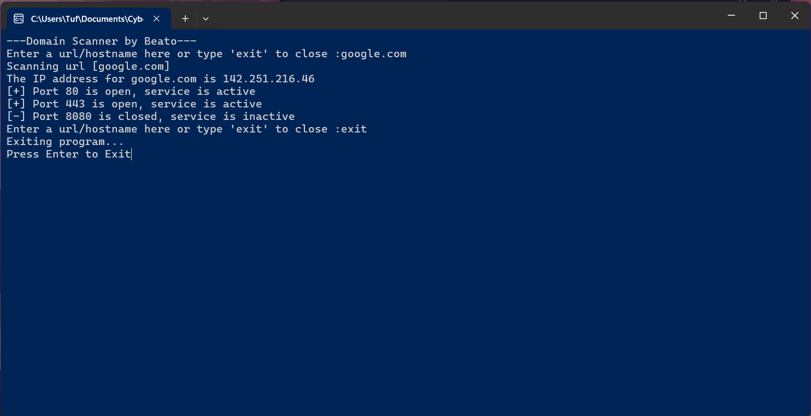

# Domain Scanner by Beato

This is a Python-based networking tool designed to resolve domain names to IP addresses and scan for active web services [only ports 80,443,8080].

## What it does
* **DNS Lookup:** Finds the IP address of any website URL you enter.
* **Service Check:** Automatically checks if Port 80 (HTTP), 443 (HTTPS), or 8080 are open and active.
* **Easy Exit:** Includes a simple "exit" command to close the loop.

## How to use it
1. Run the program.
2. Enter a URL (like `google.com`) when prompted.
3. The program will display the IP and tell you which ports are open.
4. Type `exit` to stop.

## Screenshot

## Note for Users
This tool is for educational use and ethical hacking only.
